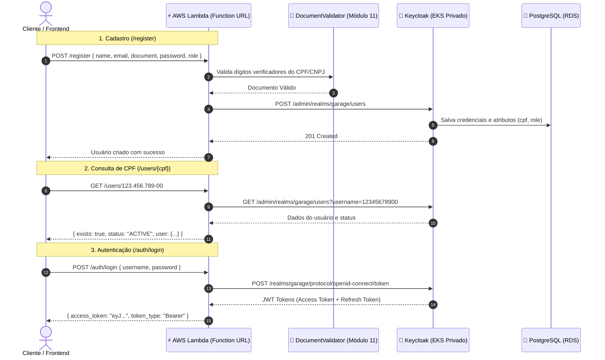

# ⚡ Passo 3: Auth & User Management Lambda (`15-soat-tech-challenge-lamda`)

Este repositório é o **terceiro passo** da esteira de infraestrutura. Ele provisiona uma função **AWS Lambda Serverless** exposta via **Lambda Function URL pública**, responsável pelo cadastro de usuários com validação de documentos (**CPF e CNPJ**), consulta de status cadastral e autenticação via **Keycloak (no EKS)** com emissão de tokens **JWT**.

---

## 📌 Pré-Requisitos Obrigatórios

> [!IMPORTANT]
> - O **Passo 1 (`iac-k8s`)** DEVE estar aplicado (para que a VPC, subnets privadas e o serviço do Keycloak existam).
> - O **Passo 2 (`iac-db`)** DEVE estar aplicado (para que o Keycloak consiga persistir os dados no RDS PostgreSQL).

---

## 🏛️ Fluxo Serverless e Segurança



---

## 🧪 1. Execução dos Testes Unitários

Antes de realizar o deploy na nuvem, você pode rodar os testes unitários automatizados (14 testes cobrindo algoritmos de validação do CPF, CNPJ, detecção de erros, tratamento de CORS e rotas HTTP):

```bash
npm test
```

Resultado esperado:
```
✔ DocumentValidator - isValidCPF with valid CPFs
✔ DocumentValidator - isValidCPF with invalid CPFs
✔ DocumentValidator - isValidCNPJ with valid CNPJs
✔ Lambda Router - OPTIONS preflight
✔ Lambda Router - Register validation failure for invalid CPF
...
ℹ tests 14 | pass 14 | fail 0
```

---

## ⚙️ 2. Execução do Terraform na AWS

Certifique-se de estar com as credenciais da sessão do AWS Learner Lab ativas no seu terminal.

Dentro da pasta `15-soat-tech-challenge-lamda`:

```bash
# 1. Inicializar plugins
terraform init

# 2. Validar sintaxe
terraform validate

# 3. Aplicar o deploy da Lambda e Function URL
terraform apply -auto-approve
```

Ao término, o Terraform exibirá a **URL pública da Lambda**:
```
Outputs:
lambda_function_url = "https://xxxxxx.lambda-url.us-east-1.on.aws/"
```

---

## 🌐 3. Como Testar os 3 Endpoints (Exemplos Práticos com cURL)

Substitua `https://<lambda-url>` pela URL gerada nos outputs do Terraform:

### Endpoint 1: 📝 Cadastro de Usuário (`POST /register`)
Valida os dígitos verificadores (CPF ou CNPJ) e registra o cliente/funcionário no Keycloak:

```bash
curl --location 'https://<lambda-url>/register' \
--header 'Content-Type: application/json' \
--data-raw '{
    "name": "Carlos Eduardo",
    "email": "carlos@garage.com",
    "document": "529.982.247-25",
    "password": "SenhaForte@2026",
    "role": "CUSTOMER"
}'
```

**Resposta de Sucesso (201 Created)**:
```json
{
  "success": true,
  "message": "Usuário cadastrado com sucesso no Keycloak.",
  "user": {
    "id": "b8f031bb-c419-4cb5-a131-0c58fb0cb0b2",
    "name": "Carlos Eduardo",
    "email": "carlos@garage.com",
    "document": "52998224725",
    "formatted_document": "529.982.247-25",
    "document_type": "CPF",
    "role": "CUSTOMER"
  }
}
```

---

### Endpoint 2: 🔍 Consulta por CPF (`GET /users/{cpf}`)
Verifica a existência do CPF e situação cadastral:

```bash
curl --location 'https://<lambda-url>/users/529.982.247-25'
```

**Resposta de Sucesso (200 OK)**:
```json
{
  "exists": true,
  "status": "ACTIVE",
  "user": {
    "id": "b8f031bb-c419-4cb5-a131-0c58fb0cb0b2",
    "name": "Carlos Eduardo",
    "email": "carlos@garage.com",
    "cpf": "52998224725",
    "formatted_cpf": "529.982.247-25",
    "roles": ["CUSTOMER"],
    "created_at": 1740000000000
  }
}
```

---

### Endpoint 3: 🔐 Autenticação e Emissão de JWT (`POST /auth/login`)
Autentica com CPF ou E-mail e Senha e retorna o token JWT assinado para consumir a aplicação:

```bash
curl --location 'https://<lambda-url>/auth/login' \
--header 'Content-Type: application/json' \
--data-raw '{
    "username": "529.982.247-25",
    "password": "SenhaForte@2026"
}'
```

**Resposta de Sucesso (200 OK)**:
```json
{
  "access_token": "eyJhbGciOiJSUzI1NiIsInR5cCI6IkpXVCJ9...",
  "token_type": "Bearer",
  "expires_in": 3600,
  "refresh_token": "eyJhbGciOiJIUzUxMiIsInR5cCI6IkpXVCJ9...",
  "scope": "openid email profile"
}
```

---

## 🛑 4. Encerramento do Laboratório (Ordem de Destruição)

Ao finalizar as atividades ou os testes do dia, para não esgotar o orçamento de US$ 50/100 do Learner Lab, destrua a infraestrutura na **ordem estritamente inversa**:

```bash
# 1º Passo: Destruir a Lambda
cd c:/git/fiap/15-soat-tech-challenge-lamda
terraform destroy -auto-approve

# 2º Passo: Destruir o RDS e Observabilidade
cd c:/git/fiap/15-soat-tech-challenge-iac-db
terraform destroy -auto-approve

# 3º Passo: Destruir o EKS, VPC e Gateways
cd c:/git/fiap/15-soat-tech-challenge-iac-k8s
terraform destroy -auto-approve
```
