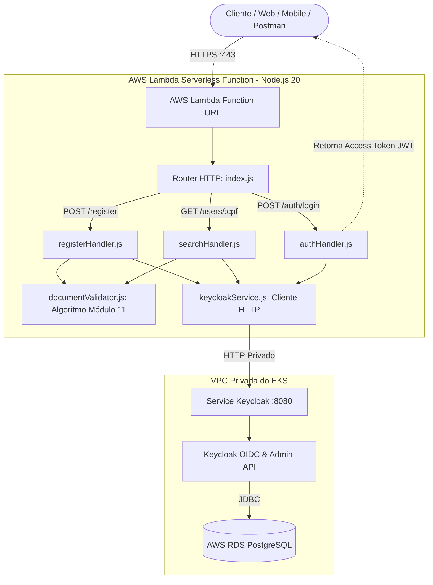

# ⚡ Auth & User Management Lambda Serverless (`15-soat-tech-challenge-lamda`)

Componente **Serverless na AWS** responsável pela autenticação, validação algorítmica de documentos brasileiros (**CPF e CNPJ**) e gestão de identidades integrado ao **Keycloak (no EKS)** com emissão de tokens **JWT**.

---

## 🎯 1. Descrição do Propósito

A função AWS Lambda implementa um ponto de entrada serverless rápido, seguro e desacoplado para operações de identidade no ecossistema da oficina mecânica:
* **Validação Algorítmica Rigorosa de Documentos**: Implementação pura em Node.js do algoritmo oficial **Módulo 11 da Receita Federal** para validação dos 2 dígitos verificadores de CPF (11 dígitos) e CNPJ (14 dígitos), rejeitando sequências repetidas (`111.111.111-11`, etc.) e entradas mal formatadas.
* **Cadastro Automatizado de Usuários**: Integração com a API Admin do Keycloak para criação de usuários com perfis distintos (`CUSTOMER` para autoatendimento e `EMPLOYEE` para mecânicos/atendentes).
* **Consulta de Status Cadastral**: Endpoint leve de verificação por CPF para verificar existência prévia e situação cadastral (`ACTIVE` ou `DISABLED`).
* **Autenticação OIDC e Emissão de JWT**: Processamento de login com emissão de tokens criptografados (`access_token`, `refresh_token`) consumíveis no AWS API Gateway e nas APIs do backend.
* **Acesso Público sem Gateway Dedicado**: Exposição direta via **AWS Lambda Function URL** com suporte total a CORS para aplicações web e mobile.

---

## 💻 2. Tecnologias Utilizadas

* **Runtime & Linguagem**: Node.js 20.x (utilizando recursos nativos do Node 20 como `fetch` e `URLSearchParams`).
* **Cloud Provider & Computação Serverless**: AWS Lambda vinculada às subnets privadas da VPC do EKS para comunicação com o Keycloak.
* **Exposição de Rede**: AWS Lambda Function URL (HTTPS nativo com autorização pública e CORS).
* **Gestão de Identidade & OIDC**: Keycloak Admin REST API e OpenID Connect Token Endpoint (`grant_type=password`).
* **Infraestrutura como Código**: Terraform 1.6+ (com empacotamento automático `archive_file` e descoberta de VPC via tags).
* **Testes Automatizados**: Node.js Test Runner nativo (`node:test` e `node:assert`).
* **Integração Contínua (CI/CD)**: GitHub Actions (`.github/workflows/terraform.yml`).

---

## 🏛️ 3. Diagrama da Arquitetura do Repositório



---

## ⚙️ 4. Passos para Execução e Deploy

> [!CAUTION]
> **DIRETRIZ MANDATÓRIA DE DEVSECOPS: NUNCA MAPEAR DADOS SENSÍVEIS NO CÓDIGO FONTE**
> É **estritamente proibido** comitar senhas de admin do Keycloak, client secrets, tokens de API ou credenciais da AWS em arquivos de código (`.js`), variáveis do Terraform (`.tf`, `.tfvars`) ou scripts.
> Todos os dados confidenciais **devem ser configurados exclusivamente nos Segredos da Pipeline (GitHub Actions Secrets)** e passados à função Lambda via variáveis de ambiente criptografadas.

### 4.1. Execução dos Testes Unitários Locais

A suíte inclui 14 testes automatizados cobrindo todas as regras de CPF, CNPJ, roteamento e CORS:

```bash
# Executar todos os testes com Node nativo
npm test
```

### 4.2. Provisionamento do Terraform na AWS
Certifique-se de que os Passos 1 (`iac-k8s`) e 2 (`iac-db`) já foram provisionados na AWS:

```bash
# 1. Inicializar
terraform init

# 2. Validar
terraform validate

# 3. Aplicar o deploy da Lambda
terraform apply -auto-approve
```

O Terraform imprimirá a **Function URL pública**:
```
Outputs:
lambda_function_url = "https://xxxxxx.lambda-url.us-east-1.on.aws/"
```

### 4.3. Automação via GitHub Actions
A pipeline em `.github/workflows/terraform.yml` roda os testes unitários (`npm test`) e executa o `terraform apply` a cada push na branch principal.

---

## 📑 5. Link para o Swagger e Postman das APIs

### 🌐 Especificação das Rotas da Lambda (OpenAPI / Swagger):
Você pode importar a especificação OpenAPI 3.0 das rotas da Lambda no Swagger Editor ou Postman:

| Rota | Método | Descrição |
| :--- | :---: | :--- |
| **`/register`** | `POST` | Cadastra cliente/funcionário validando os dígitos verificadores de CPF/CNPJ |
| **`/users/{cpf}`** | `GET` | Consulta a existência e a situação cadastral do usuário no Keycloak |
| **`/auth/login`** | `POST` | Autentica usuário e senha gerando o token JWT (OpenID Connect) |
| **`/health`** | `GET` | Health check da função Lambda |

---

### 📬 Exemplos Prontos para Postman e cURL:

#### 1. 📝 Cadastro de Cliente com Validação de CPF (`POST /register`)
```bash
curl --location 'https://<lambda-url>/register' \
--header 'Content-Type: application/json' \
--data-raw '{
    "name": "Carlos Eduardo",
    "email": "carlos@garage.com",
    "document": "529.982.247-25",
    "password": "SenhaForte@2026",
    "role": "CUSTOMER"
}'
```

**Resposta (201 Created)**:
```json
{
  "success": true,
  "message": "Usuário cadastrado com sucesso no Keycloak.",
  "user": {
    "id": "b8f031bb-c419-4cb5-a131-0c58fb0cb0b2",
    "name": "Carlos Eduardo",
    "email": "carlos@garage.com",
    "document": "52998224725",
    "formatted_document": "529.982.247-25",
    "document_type": "CPF",
    "role": "CUSTOMER"
  }
}
```

---

#### 2. 🔍 Consulta de Situação Cadastral (`GET /users/{cpf}`)
```bash
curl --location 'https://<lambda-url>/users/529.982.247-25'
```

**Resposta (200 OK)**:
```json
{
  "exists": true,
  "status": "ACTIVE",
  "user": {
    "id": "b8f031bb-c419-4cb5-a131-0c58fb0cb0b2",
    "name": "Carlos Eduardo",
    "email": "carlos@garage.com",
    "cpf": "52998224725",
    "formatted_cpf": "529.982.247-25",
    "roles": ["CUSTOMER"],
    "created_at": 1740000000000
  }
}
```

---

#### 3. 🔐 Autenticação e Emissão de Token JWT (`POST /auth/login`)
```bash
curl --location 'https://<lambda-url>/auth/login' \
--header 'Content-Type: application/json' \
--data-raw '{
    "username": "529.982.247-25",
    "password": "SenhaForte@2026"
}'
```

**Resposta (200 OK)**:
```json
{
  "access_token": "eyJhbGciOiJSUzI1NiIsInR5cCI6IkpXVCJ9...",
  "token_type": "Bearer",
  "expires_in": 3600,
  "refresh_token": "eyJhbGciOiJIUzUxMiIsInR5cCI6IkpXVCJ9...",
  "scope": "openid email profile"
}
```
